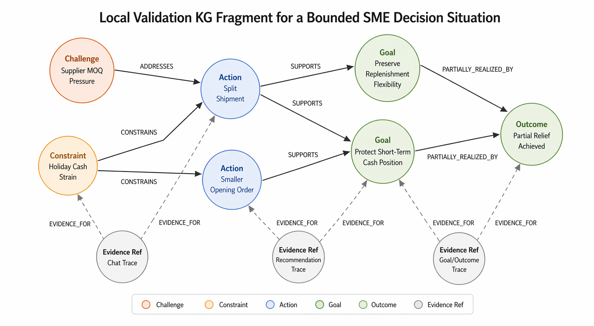
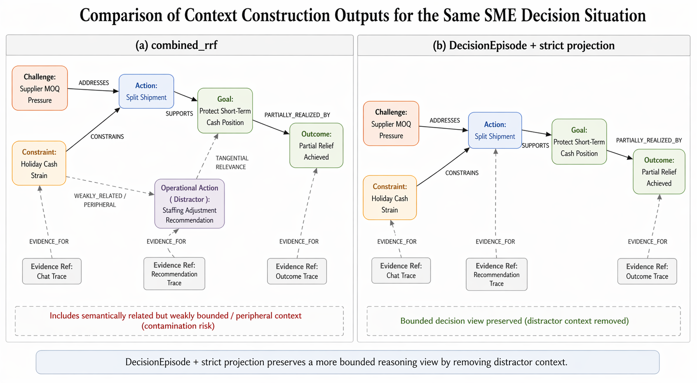

# 5. Experiments

*Paper draft section for* `Bridging Data, Signals, and Growth: A Graph-Based AI for SME Decision-Making`

## 5.1 Experiment Design

### 5.1.1 Evaluation objective and bounded empirical claim

This chapter evaluates a narrow empirical question derived from the paper's method claim. Section 3 argued that a graph substrate alone is not sufficient for decision-grade support in SME contexts. The proposed contribution is an intermediate `DecisionEpisode` layer that organizes distributed business traces into bounded decision situations before query-time reasoning. The empirical objective is therefore not to establish broad product performance, firm-level business impact, or universal superiority of graph-based AI systems. It is to test whether an explicit episode-oriented organization layer can improve decision-context construction under controlled comparison conditions.

The bounded empirical claim is correspondingly narrow. The experiment asks whether, when the underlying business graph and query intent are held constant, `DecisionEpisode`-oriented context construction can produce a more bounded and decision-useful context package than fragment-oriented or relation-rich retrieval alone. The most defensible version of this claim is local and conditional: if gains appear, they should be interpreted as evidence that episode-bounded organization helps in contamination-prone SME decision situations, not as evidence that the overall system has been comprehensively validated.

### 5.1.2 Why the earlier pilot design was no longer sufficient

The earlier evaluation design and preliminary pilot established a useful starting point. They compared fragment-oriented retrieval with a scenario-oriented proxy over the same graph and showed that richer relational context could improve completeness and traceability on a small number of cases. However, that earlier design was not sufficient for the current paper objective for three reasons.

First, the original pilot cases were relatively clean. They were adequate for showing feasibility, but they did not create enough pressure on the comparison to reveal whether `DecisionEpisode` actually improves bounded reasoning under ambiguity. Second, the previous scenario-oriented condition was still close to a richer retrieval bundle. It improved relational exposure, but it did not yet sharply separate focal decision context from adjacent but non-focal material. Third, the earlier scoring logic emphasized contextual richness more than situation-level boundedness. This made it difficult to distinguish a package that was simply richer from a package that was more decision-grade in the sense intended by the method.

For these reasons, the current experiment should be understood as a targeted re-test rather than a simple extension of the first pilot. Its purpose is to probe the specific failure mode that motivates the paper: the retrieval of semantically related but insufficiently bounded context.

### 5.1.3 Revised experiment logic

The revised experiment is organized around two complementary evaluation sets. The first is a targeted stress-test set designed to expose cases in which richer retrieval is likely to blur episode boundaries. The second is a broader curated regression set designed to check that the stricter episode-oriented condition does not collapse outside those hardest cases.

The stress-test set is the main proof-oriented comparison. It contains local curated decision situations from three recurring task families: supplier minimum-order-quantity pressure under cash constraints, weekend staffing or rota conflict under service constraints, and sales decline recovery under attribution uncertainty. Within these task families, the stress cases are constructed to represent three recurrent difficulties: `cross_episode_contamination`, `multi_action_confusion`, and `same_trigger_different_goal`. These are precisely the kinds of situations in which the paper expects a bounded episode layer to matter most.

The full curated regression set plays a different role. It is not the main source of the paper's strongest empirical statement. Instead, it functions as a stability check. If `DecisionEpisode` only wins on stress cases but catastrophically degrades outside them, the argument for bounded organization would remain weak. The regression set therefore tests whether the stricter condition remains broadly competitive even when the case is cleaner and richer retrieval is already strong.

### 5.1.4 Experimental conditions

The current design uses four context-construction conditions, although only two are central to the main targeted claim.

`text_rag` is a plain fragmented text retrieval baseline over local textual materials. It acts as an external baseline and helps clarify that the paper is not only comparing graph variants against each other. It also provides a lower-bound comparison for what can be recovered from fragmented text chunks without stronger structural organization.

`node_rrf` is the graph-fragment baseline. It retrieves node-level graph material without stronger bounded organization into a single decision situation. This condition remains useful because it approximates a common graph retrieval pattern: the system returns relevant fragments, but leaves the user to reconstruct the decision situation.

`combined_rrf` is the strongest non-episode graph baseline and the main comparator for `DecisionEpisode`. It provides a richer graph package than `node_rrf` by exposing additional relational material. It is therefore a more demanding baseline than fragment-only retrieval. In the current experiment, `combined_rrf` should be interpreted as relation-rich retrieval, not as an explicit episode layer.

`DecisionEpisode + strict projection` is the method-facing condition. It first constructs an explicit `DecisionEpisode` object from the same local evidence bundle, preferring constrained LLM-based slot normalization with rules-based fallback. It then projects that episode into a strict, query-time bounded view. This condition is intended to test not whether more information can be retrieved, but whether bounded episode organization can produce a cleaner reasoning package from the same information source.

### 5.1.5 Same-source comparison logic

The comparison logic is intentionally same-source. Across conditions, the underlying information source remains fixed: the graph substrate, the case definition, the local decision query, and the general retrieval budget are held constant unless a stated methodological reason requires otherwise. What changes is the way the context package is assembled and bounded.

This same-source design is critical for the paper's logic. The experiment is not asking whether one system has access to more information than another. It is asking whether one organizational strategy makes the same information more useful for bounded SME decision support. This is why the experiment should be described as a decision-context construction comparison rather than as a system benchmark.

### 5.1.6 Main proof set versus safety-check set

The primary claim in the paper should rest on the stress-test set rather than on the full regression set. The stress-test set is where the method has the clearest theoretical reason to help: when semantically related evidence is available, but the decision boundary is easy to blur. If `DecisionEpisode + strict projection` performs better there, that result is informative because it aligns with the method's intended function.

The full curated regression set should be used more cautiously. It is valuable because it shows whether the stricter condition remains broadly serviceable, but it is not the right basis for claiming strong average superiority. A mixed regression pattern is compatible with the paper's argument, so long as the stress-test superiority remains clear and the limits of the broader result are explicitly stated.

### 5.1.7 Non-claims and evidential boundary

This experiment does not validate business effectiveness, production readiness, or a mature end-to-end scenario memory system. It does not show that `DecisionEpisode` extraction is robust in the large-scale sense, nor does it establish a live benchmark over production-scale enterprise graphs. The current evidence is prototype-level, local, and curated.

Accordingly, the strongest legitimate interpretation of the experiment is narrow. If the targeted stress-test favors `DecisionEpisode + strict projection`, the result supports the claim that bounded episode organization can improve coherence, traceability, and decision usefulness in contamination-prone decision situations. It does not support the stronger claim that `DecisionEpisode` universally dominates richer graph retrieval across all settings or that the system improves SME outcomes in practice.

## 5.2 Experimental Data, Corpus Construction, and Validation KG

### 5.2.1 Source assets and provenance

The current experiment does not rely on open real-world firm data or on a production-scale enterprise graph. Instead, it uses the current ProsperPath prototype assets as a local, curated, paper-facing validation substrate. These assets include mock conversational traces, derived recommendation outputs, graph-linked decision traces, and supporting local artifacts that together make it possible to construct bounded SME decision situations for inspection.

This provenance matters for the scope of the paper's empirical claims. Because the materials are local and curated, the resulting evidence can support prototype validation, method illustration, and narrow comparative testing. It cannot support broad claims about external validity, general SME coverage, or production readiness. The experiment should therefore be read as a structured validation exercise over a local corpus rather than as a field benchmark.

### 5.2.2 Decision situations and task families

The corpus is organized around `decision situations` rather than around broad company histories. A decision situation is a bounded evaluation case consisting of a focal decision query, a recognizable business problem, a graph-backed context bundle, and one or more candidate actions that can be related to constraints, goals, and outcomes. This unit is appropriate for the current stage of the work because the implementation does not yet expose a stable ground-truth `DecisionEpisode` object that can function directly as the evaluation unit.

The current corpus focuses on three recurring task families that are both SME-relevant and sufficiently represented in the available materials:

- supplier MOQ pressure under cash-flow constraints
- weekend staffing or rota conflict under service constraints
- sales decline recovery under attribution uncertainty

These families were chosen because they involve practical short-horizon decisions rather than generic descriptive questions. Each requires more than isolated facts. A usable context package should expose some combination of triggering problem, operative constraint, candidate response, target state, and partial consequence.

### 5.2.3 Representative source asset types

Although the current paper does not reproduce the full ProsperPath repository structure in the main text, the local validation corpus is built from a small number of recurring asset types. In practical terms, four source types are especially important.

First, chat-like traces provide the initial problem framing. These materials contain owner-facing business concerns, operational pressures, and natural-language descriptions of what needs attention. They supply much of the raw wording for the focal decision query and for the trigger side of the later graph representation.

Second, recommendation outputs provide candidate actions and action rationales. These artifacts are important because they turn business pressure into inspectable response options rather than leaving the corpus at the level of problem description alone.

Third, derived graph traces provide typed relations among challenges, actions, goals, and partial outcomes. These relations make it possible to distinguish between a merely relevant fragment and a decision-aligned path through the local graph.

Fourth, local evidence references provide the grounding layer later used for validation. They make it possible to trace a recovered slot back to a supporting node, edge, or derived trace rather than treating the experiment as ungrounded summarization.

Taken together, these source types make the current corpus richer than a plain text collection while still remaining local and prototype-facing.

### 5.2.4 Representative decision-situation examples

The current corpus can be understood more concretely through three compact examples, each corresponding to one of the recurring task families.

#### Supplier MOQ under cash pressure

A representative supplier case asks what bounded supplier response should be taken when minimum-order-quantity pressure collides with holiday cash strain. In this type of case, the trigger comes from supplier pressure, the constraint comes from short-horizon cash protection, the action trace centers on split shipment or smaller opening-order responses, and the partial goal is to preserve replenishment flexibility without worsening liquidity pressure.

#### Weekend staffing under service constraints

A representative staffing case asks what bounded staffing response should address weekend rota conflict without drifting into unrelated sales-recovery tactics. In this type of case, the trigger is a rota or shift-coverage problem, the constraint is service continuity, the action trace centers on standby shift or swap workflows, and the evaluative question is whether the package stays inside the staffing episode rather than mixing in adjacent commercial interventions.

#### Sales decline recovery under attribution uncertainty

A representative sales case asks what bounded conversion-recovery response should follow an October decline when attribution remains unclear. In this type of case, the trigger is declining revenue or conversion, the constraint is attribution uncertainty and short-term decision pressure, the action trace centers on bundle or channel-adjustment interventions, and the key issue is whether the package preserves the conversion-recovery path rather than importing supplier or cash-protection tactics.

These examples are intentionally small. Their function is not to present full case records, but to show the reader what a usable decision situation looks like in the current validation corpus.

### 5.2.5 Curated case construction

Within these task families, the evaluation corpus is not assembled as an arbitrary set of queries. Cases are curated to represent bounded decision situations with enough inspectable structure for comparison. A usable case must contain at least three kinds of material: a problem trace, an action or recommendation trace, and a goal, benefit, or outcome fragment that makes the decision situation interpretable as more than a disconnected retrieval bundle.

The targeted re-test further refines this curation by adding specific stress patterns. The stress-test set contains cases that instantiate one of three designed difficulties:

- `cross_episode_contamination`
- `multi_action_confusion`
- `same_trigger_different_goal`

These stress types are important because they create situations in which relation-rich retrieval may remain relevant but insufficiently bounded. In other words, the experiment corpus is not only a set of business examples. It is also a controlled way of exposing where bounded episode organization should matter.

### 5.2.6 What counts as a usable decision situation

The current validation corpus uses conservative inclusion logic. A case is usable when it is clearly decision-oriented, SME-relevant, and supported by enough graph-linked material to compare competing context-construction strategies. In practice, this means the case should expose at least one challenge, crisis, or business-pressure trace; at least one recommendation or action path; and at least one goal, benefit statement, or partial outcome indication.

Cases dominated by generic owner metadata, weakly connected retrieval noise, or missing action pathways should be excluded. Likewise, a case that retrieves many semantically adjacent fragments but cannot be interpreted as a bounded decision situation is not appropriate for this evaluation. This conservative filtering is important because the experiment aims to compare context organization quality, not retrieval breadth in the abstract.

### 5.2.7 From local corpus to validation KG

The validation KG used in this experiment is not a separate graph built exclusively for the paper. It is the graph substrate implied by the current ProsperPath local assets and their derived traces. The corpus contributes the textual and semi-structured materials, while the derived outputs contribute typed relations, recommendation/action associations, and local evidence references that make bounded comparison possible.

Operationally, the corpus-to-graph transformation preserves the paper's methodological distinction between raw source material and decision-support structure. Source texts, local outputs, and recommendation traces do not function directly as the evaluation object. Instead, they are mapped into graph-backed entities, relations, and support traces that can be assembled into graph retrieval packages and, later, into `DecisionEpisode` objects.

### 5.2.8 Validation KG composition example

A representative local graph fragment for the current experiment can be described as a compact challenge-action-goal-outcome structure anchored by evidence references. In a supplier MOQ case, for example, the graph may contain a challenge node representing supplier minimum-order-quantity pressure, an action or recommendation node representing split shipment or smaller opening-order tactics, a goal node representing cash preservation or replenishment flexibility, and a partial outcome node indicating whether the pressure was mitigated. These nodes are then connected by typed edges such as `ADDRESSES`, `SUPPORTS`, or other relation-backed traces that preserve the local decision structure.

*Figure 6. A local validation KG fragment for a bounded supplier MOQ decision situation. The graph is intentionally small and decision-centered. It preserves the challenge-action-goal-outcome structure needed for later episode construction, while keeping evidence references visible enough to support traceability during validation.*

This is important for the paper because the validation KG is not merely a storage substrate. It is the layer that makes episode-oriented comparison possible. The later `DecisionEpisode` object does not arise from raw text alone. It arises from a graph-backed local structure in which challenge, action, goal, and evidence can already be related to one another in inspectable form.

Figure 6 illustrates this point more effectively than a full graph screenshot would. For the present paper, the most informative visualization is a small decision-centered subgraph showing the challenge-action-goal-outcome pattern and the evidence-linked traces that support later projection. A full graph screenshot would be far less useful because the experiment depends on bounded local structure rather than on total graph scale.

### 5.2.9 What the validation KG contains

The current validation KG contains enough representational structure to support prototype-level comparison. It includes business entities and business-state references associated with the selected decision situations. It also includes relation-backed traces linking problem statements, actions, recommendations, and partial outcomes. These traces make it possible to distinguish between a package that merely surfaces relevant fragments and one that organizes them into a more interpretable decision context.

At a practical level, the current validation KG contains the following kinds of material:

- entities tied to focal business actors, operational conditions, and business objects
- relations connecting business problems, actions, goals, and partial outcomes
- recommendation or action traces that can be linked back to specific decision contexts
- goal and outcome fragments that make success criteria or consequences partially visible
- evidence references that allow slot-level grounding in later validation

This is sufficient for the current empirical purpose because the experiment is not trying to validate end-to-end world modeling. It is trying to test whether bounded organization over a graph-backed substrate improves decision-context construction.

### 5.2.10 What the validation KG does not yet contain

The current validation KG remains limited in several important ways. It does not yet provide a robust uncertainty layer, so explicit missing-information modeling is still weak. It also does not contain stable ground-truth `DecisionEpisode` objects that could serve as authoritative supervision targets for large-scale extraction evaluation. In addition, its coverage is local and curated rather than production-scale, which limits what can be claimed about generalization.

These limits matter for the framing of the experiment. The validation KG is strong enough to support a prototype comparison between bounded and less-bounded context construction strategies. It is not strong enough to support robust claims about extraction accuracy in the large, broad enterprise applicability, or downstream business impact.

### 5.2.11 Why this data substrate is still useful for the paper

Despite these limits, the current data and validation KG are appropriate for the paper's present stage. They provide exactly what is needed for a narrow empirical test: repeated SME-like decision situations, inspectable action and goal traces, relation-backed local evidence, and sufficient variation to create contamination-prone cases. This makes it possible to test the paper's central methodological intuition under controlled conditions, while remaining explicit that the evidence base is still prototype-level and curated.

## 5.3 Validation Method and Results

### 5.3.1 Why the earlier evaluation-design notes are no longer sufficient as-is

The earlier evaluation-design notes were useful for defining the original pilot logic, the initial baselines, and the first-round scoring ideas. However, they were written before the current targeted re-test was completed. As a result, they no longer fully describe the actual validation path used in the most informative comparison round.

The current section therefore serves a different purpose. It does not replace the earlier notes, but it rewrites the validation method in light of the experiment that has now actually been run. In particular, it reflects three changes in the empirical setup: the move from a simple pilot to a targeted stress-test, the introduction of a stricter episode-bounded projection step, and the shift from general contextual richness toward explicit measurement of boundedness, coherence, and contamination.

### 5.3.2 Validation unit and audit support

The primary validation unit in the current experiment remains the `decision situation`, not a final mature `DecisionEpisode` object. This choice reflects the current state of the implementation and the current evidential boundary. While the system now contains an explicit `DecisionEpisode` layer, the evaluation still operates over curated decision situations because these provide the cleanest unit for controlled comparison across conditions.

To support scoring, the current experiment also uses a small feasibility-level extraction audit. The role of this audit is limited but important. It does not function as a full extraction benchmark. Instead, it provides enough structured reference information to evaluate whether a context package recovers the relevant decision slots and whether it remains inside the intended decision boundary. The audit therefore supports later scoring of both slot recovery and contamination-related errors.

### 5.3.3 Validation pipeline

The current validation pipeline compares context-construction conditions over the same underlying local graph substrate and the same focal decision situation. For each case, a context package is first built under the relevant baseline condition. In the method-facing condition, a `DecisionEpisode` object is then constructed from the same evidence bundle, with constrained LLM-based slot normalization preferred and rules-based recovery used as fallback when necessary. That episode is subsequently projected into a strict, query-time bounded reasoning view.

The key point is that the method-facing condition is not given a different underlying information source. What changes is the organization logic applied to that source. This is why the result can be interpreted as evidence about context construction rather than about information access.

### 5.3.4 Conditions used in the validation

The broader comparison framework retains four conditions: `text_rag`, `node_rrf`, `combined_rrf`, and `DecisionEpisode + strict projection`. However, the targeted empirical claim in this section rests primarily on the comparison between `combined_rrf` and `DecisionEpisode + strict projection`.

`combined_rrf` is the appropriate main comparator because it is the strongest non-episode graph baseline in the current setup. It already exposes richer relational structure than node-only retrieval, which makes it a demanding baseline. If `DecisionEpisode` can outperform it on hard cases, that result is substantially more meaningful than merely outperforming fragmented retrieval.

`DecisionEpisode + strict projection` is the method-facing condition because it introduces two linked operations: explicit episode organization and strict bounded projection. The projection stage is essential. Without it, the episode condition would risk collapsing back into a richer but weakly bounded package. The current validation therefore tests not only whether `DecisionEpisode` can be constructed, but also whether strict episode-bounded projection yields a cleaner reasoning view.

### 5.3.5 Scoring design

The current scorer uses four primary dimensions: `slot_completeness`, `slot_traceability`, `situation_coherence`, and `decision_usefulness`. These dimensions are narrower and more structurally aligned with the method than the earlier, broader pilot rubric.

`slot_completeness` evaluates whether the package recovers the core components of the decision situation, especially `trigger`, `goal`, `constraints`, `actions`, and `outcome`. `slot_traceability` evaluates whether recovered material remains visibly grounded in evidence references rather than appearing as unsupported synthesis. `situation_coherence` evaluates whether the package remains within a single decision situation rather than mixing adjacent but non-focal content. `decision_usefulness` evaluates whether the package supports a plausible decision discussion by jointly recovering the decision goal, operative constraints, and an aligned action path.

The shift toward coherence and contamination matters because the paper's empirical question is not simply whether richer packages retrieve more relevant information. It is whether they preserve a bounded decision structure.

### 5.3.6 Stress-test results

The targeted stress-test set provides the most informative current result. On this set, `DecisionEpisode + strict projection` outperformed `combined_rrf`.

| condition | completeness | traceability | usefulness | coherence |
| --- | ---: | ---: | ---: | ---: |
| `combined_rrf` | 4.02 | 3.64 | 2.74 | 3.83 |
| `DecisionEpisode + strict projection` | 4.27 | 4.50 | 3.93 | 5.00 |

The pairwise outcomes on the stress-test set were:

- `DecisionEpisode` wins: `6`
- `combined_rrf` wins: `1`
- ties: `2`

This pattern supports a narrow but meaningful interpretation. On contamination-prone local cases, the episode-oriented condition produced cleaner, more bounded context packages than richer retrieval alone. The main mechanism visible in the case-level summaries is not that the episode condition simply retrieved more material. Rather, it dropped distractor actions, excluded adjacent episode evidence, and preserved the primary action-goal path more cleanly.

### 5.3.7 Why the method wins on the hardest cases

The case-level results suggest that the advantage of `DecisionEpisode + strict projection` lies in boundedness rather than in retrieval breadth. On `cross_episode_contamination` cases, the episode condition benefited from explicitly removing semantically related but non-focal material. On `multi_action_confusion` cases, it more clearly preserved the action path aligned with the focal decision goal. These are exactly the circumstances under which a dedicated episode layer should be useful according to the method argument in Section 3.

*Figure 7. Comparison of context-construction outputs for the same decision situation. The `combined_rrf` panel preserves relevant but weakly bounded peripheral context, whereas `DecisionEpisode + strict projection` preserves a narrower challenge-action-goal-outcome path by removing distractor material. The figure is intended to visualize the mechanism behind the stress-test gains, not to function as a benchmark result on its own.*

This matters for the paper because it connects the empirical result back to the conceptual claim. The argument was never that richer retrieval is always inferior. The argument was that retrieval without bounded organizational structure can remain decision-incomplete even when it is relevant. The stress-test superiority result is the first local evidence supporting that claim.

### 5.3.8 Full regression results and why they do not support universal superiority

The broader full curated regression set yields a more mixed result:

| condition | completeness | traceability | usefulness | coherence |
| --- | ---: | ---: | ---: | ---: |
| `text_rag` | 3.06 | 0.54 | 3.25 | 5.00 |
| `node_rrf` | 3.79 | 3.94 | 3.86 | 5.00 |
| `combined_rrf` | 4.46 | 4.57 | 3.93 | 5.00 |
| `DecisionEpisode + strict projection` | 4.24 | 4.46 | 3.86 | 5.00 |

This table should be interpreted carefully. It does not show universal superiority of the episode condition. On the broader curated set, `combined_rrf` remains competitive and in some dimensions slightly stronger. This is not fatal to the paper's claim, because the method is not primarily motivated by already-clean cases. It is motivated by ambiguity, contamination, and action-goal confusion. The broader regression result therefore functions as a safety check, not as the primary source of the paper's strongest conclusion.

### 5.3.9 Extraction audit limits

The extraction audit remains feasibility-level. It shows that some elements of the current `DecisionEpisode` pipeline are relatively stable, especially `actions`, `trigger`, and parts of `goal` recovery. It also shows clear weaknesses: `constraints` remain uneven, `uncertainties` remain poorly recovered, and fully reliable `focus` recovery has not yet been achieved.

These limits must remain visible in the write-up. The current experiment validates an inspectable prototype extraction-and-projection pipeline. It does not validate robust episode extraction in the strong sense. Any wording that blurs this distinction would overstate the evidence.

### 5.3.10 What the results support and what they do not support

The current results support a narrow statement:

> The prototype `DecisionEpisode` layer showed targeted superiority on local contamination-prone stress cases, where strict episode-bounded projection improved coherence, traceability, and decision usefulness relative to richer graph retrieval alone.

The current results do not support stronger statements such as:

- `DecisionEpisode` consistently outperformed `combined_rrf` across the evaluation set
- `DecisionEpisode` extraction is robust
- the system has been validated at production scale
- the method improves SME business outcomes

This boundary is important for the integrity of the paper. The current validation is already strong enough to support an implementation-grounded instance-validation subsection and a narrow empirical subsection on targeted stress-test superiority. It is not yet strong enough to anchor a broad results chapter without qualification.